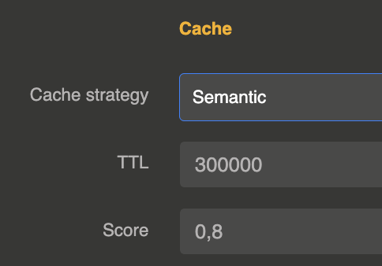

import Terminal from '@site/src/components/Terminal';

# Overview

## Quotas

Our highly flexible quota management system ensures optimal resource allocation.

With Otoroshi LLM extension, you can:

- 📏 Define quotas based on any attribute in the HTTP request
- 🏷️ Group quotas by users, API keys, or any custom identifier
- ⏳ Set time windows (per second, minute, hour, or custom intervals)

This enables precise control over token consumption and prevents overuse, ensuring smooth operation for all users.

## ⚡ Cache: Fast and Efficient

We provide a simple yet powerful caching mechanism :

- ✅ **Semantic caching** for intelligent retrieval
- 🔍 **Embeddings-based storage** for high-relevance matches
- 🗃️ **Vector search database** ensures ultra-fast lookups

This results in reduced latency and improved response times for frequently accessed data.

You can activate caching on any provider

## Simple cache

simple cache works on prompts word per word

## Semantic cache

semantic cache uses an embedding datastore to find prompt with the same semantic

## 📊 Reporting

You can use the audit events generated by your LLM usage to make some reporting dashboard and follow your metrics in live.

## Tokens rate limiting

