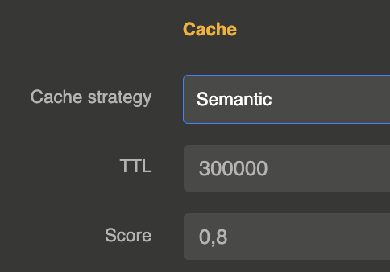

import Terminal from '@site/src/components/Terminal';

# Semantic cache

The semantic cache goes beyond exact matching: it uses **embeddings** to find prompts with the same semantic meaning, even when the wording is different. For example, "What's the weather in Paris?" and "Tell me the current weather for Paris" would match semantically.



## How it works

The semantic cache uses a two-stage lookup:

### 1. Exact match (fast path)

First, a SHA-512 hash of the messages is checked against an in-memory cache, exactly like the [simple cache](/docs/cost-optimizations/simple-cache). If an exact match is found, the response is returned immediately.

### 2. Semantic similarity (vector search)

If no exact match is found, the cache computes an embedding of the user's messages using a **local MiniLM model** (AllMiniLmL6V2, running via ONNX — no external API call needed). This embedding is compared against all stored embeddings using cosine similarity.

If a stored entry has a similarity score above the configured `score` threshold, the cached response is returned.

## Configuration

The cache is configured on the **LLM Provider entity** in the `cache` section:

```js
{
  "cache": {
    "strategy": "semantic",
    "ttl": 300000,
    "score": 0.85
  }
}
```

| Parameter | Type | Default | Description |
|-----------|------|---------|-------------|
| `strategy` | string | `"none"` | Set to `"semantic"` to enable semantic cache |
| `ttl` | number (ms) | `86400000` (24h) | Time-to-live for cached entries in milliseconds |
| `score` | number (0-1) | `0.8` | Minimum cosine similarity score for a semantic match. Higher values require closer matches. |

### Score tuning

| Score | Behavior |
|:-----:|----------|
| 0.95+ | Very strict — only near-identical prompts match |
| 0.85 | Good default — catches paraphrases while avoiding false matches |
| 0.70 | Loose — broader matching, higher risk of incorrect cache hits |
| < 0.60 | Too loose — likely to return irrelevant cached responses |

## Embedding model

The semantic cache uses the **AllMiniLmL6V2** sentence transformer model, which runs **locally** via ONNX runtime. This means:

- No external API call is needed for embedding computation
- No additional cost per cache lookup
- Low latency (typically < 10ms for embedding)
- The model is included in the extension — no separate setup required

Only messages with role `"user"` are used for semantic matching.

## Cache behavior

- Maximum **5000 entries** per provider (in-memory)
- Cached responses return **zero token usage** (no cost incurred)
- Both blocking and streaming responses are cached
- When a cached entry expires, its embedding is automatically cleaned up from the vector store

## Response headers and metadata

Same as the [simple cache](/docs/cost-optimizations/simple-cache): `X-Cache-Status`, `X-Cache-Key`, `X-Cache-Ttl`, `Age` headers and a `cache` object in response metadata.

## When to use semantic cache

- **Customer support**: Users ask the same questions with different phrasing
- **Search-like applications**: Queries with varied wording but same intent
- **Multi-language contexts**: Similar questions in slightly different formulations

For strict exact-match caching, use the [simple cache](/docs/cost-optimizations/simple-cache) instead. You can also combine both strategies by setting `"strategy": "simple,semantic"` — the simple cache is checked first (faster), then the semantic cache if no exact match is found.
