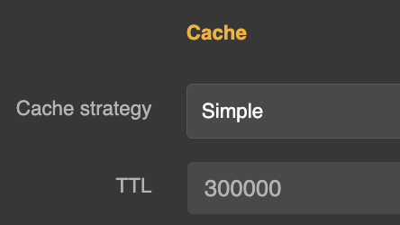

import Terminal from '@site/src/components/Terminal';

# Simple cache

The simple cache provides exact-match caching for LLM prompts. When an identical prompt (same messages, same roles, same content) is sent again within the TTL window, the cached response is returned instantly without calling the LLM provider.



## How it works

1. The cache key is computed as a **SHA-512 hash** of all messages (`role:content` pairs concatenated)
2. On a **cache hit**: the stored response is returned with zero token usage (no cost incurred)
3. On a **cache miss**: the LLM is called, and the response is stored in memory for future lookups
4. Both blocking and streaming responses are cached

The cache is an in-memory Caffeine cache with a maximum of **5000 entries**. Entries are evicted automatically when the TTL expires or when the cache is full.

## Configuration

The cache is configured on the **LLM Provider entity** in the `cache` section:

```js
{
  "cache": {
    "strategy": "simple",
    "ttl": 300000
  }
}
```

| Parameter | Type | Default | Description |
|-----------|------|---------|-------------|
| `strategy` | string | `"none"` | Set to `"simple"` to enable simple cache |
| `ttl` | number (ms) | `86400000` (24h) | Time-to-live for cached entries in milliseconds |
| `redis_url` | string | — | Optional Redis URL to use Redis as cache backend instead of in-memory |

Set `strategy` to `"none"` to disable caching entirely.

## Redis-backed cache

By default, the simple cache uses an **in-memory Caffeine cache** (max 5000 entries). This works well for single-instance deployments but the cache is not shared across Otoroshi instances.

To share the cache across a cluster, set `redis_url` to a Redis connection URI:

```js
{
  "cache": {
    "strategy": "simple",
    "ttl": 300000,
    "redis_url": "redis://localhost:6379"
  }
}
```

When Redis is configured:
- Cache entries are stored in Redis with automatic TTL expiration via `PSETEX`
- The cache is shared across all Otoroshi instances connected to the same Redis
- Redis connections are pooled and shared — if multiple providers use the same Redis URL, they share the same connection
- Responses and streaming chunks are serialized to JSON for storage

## Response headers

When the cache is active, the following headers are added to responses:

| Header | Description |
|--------|-------------|
| `X-Cache-Status` | `Hit` or `Miss` |
| `X-Cache-Key` | The SHA-512 cache key |
| `X-Cache-Ttl` | Configured TTL in milliseconds |
| `Age` | Time elapsed since the entry was cached (in seconds) |

## Response metadata

Cached responses include a `cache` object in the response metadata:

```js
{
  "cache": {
    "status": "Hit",
    "key": "a1b2c3d4...",
    "ttl": 300000,
    "age": 12345
  }
}
```

## When to use simple cache

- **FAQ-style applications**: When the same questions are asked frequently with identical wording
- **Development and testing**: To avoid repeated LLM calls during development
- **High-volume endpoints**: When the same prompts are sent by many users

For cases where users ask the same question with different wording, use the [semantic cache](/docs/cost-optimizations/semantic-cache) instead.
