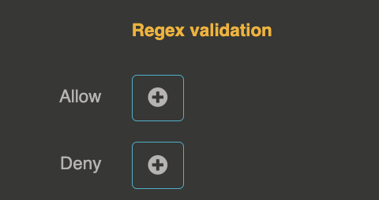
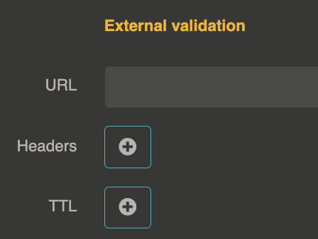
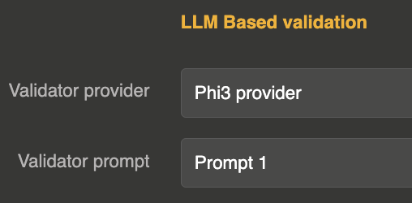

import Terminal from '@site/src/components/Terminal';

# Provider validation

you can validate prompts sent to a provider

## Regex prompt validation

## External prompt validation

## LLM prompt validation

