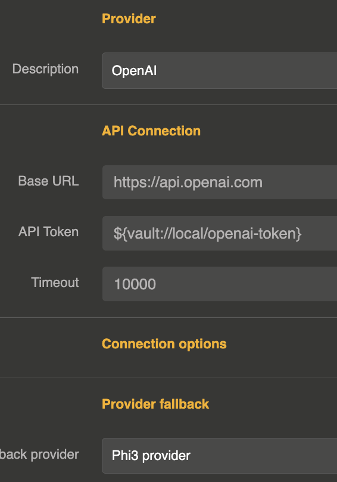

import Terminal from '@site/src/components/Terminal';

# Fallback

The fallback mechanism ensures continuity of service by automatically switching to an alternative LLM provider when the primary provider fails.

## How it works

When a provider has a fallback configured, every LLM request is first sent to the primary provider. If the request fails (error response or exception), the system automatically retries the same request against the fallback provider.

The fallback is transparent to the caller — the response format is identical regardless of which provider handled the request.



## Configuration

The fallback is configured directly on the provider entity using the `provider_fallback` field, which references the ID of another provider entity.

```js
{
  "id": "provider_openai_main",
  "name": "OpenAI (primary)",
  "provider": "openai",
  "connection": {
    "base_url": "https://api.openai.com/v1",
    "token": "sk-xxx",
    "timeout": 180000
  },
  "options": {
    "model": "gpt-4o"
  },
  "provider_fallback": "provider_mistral_backup"
}
```

| Parameter | Type | Default | Description |
|-----------|------|---------|-------------|
| `provider_fallback` | string | — | ID of the fallback provider entity |

## When fallback triggers

The fallback provider is called when:

- The primary provider returns an **error response** (e.g., rate limit exceeded, server error, authentication failure)
- The primary provider throws an **exception** (e.g., timeout, connection refused, network error)

If the fallback provider also fails, the error is returned to the caller.

## Supported operations

The fallback mechanism works for all LLM operations:

- Chat completion (blocking)
- Chat completion (streaming)
- Text completion (blocking)
- Text completion (streaming)

## Chaining fallbacks

You can chain multiple fallback providers by configuring a fallback on the fallback provider itself:

```
Provider A (primary)
  └─ fallback → Provider B
                  └─ fallback → Provider C
```

```js
// Provider A
{
  "id": "provider_a",
  "provider": "openai",
  "provider_fallback": "provider_b",
  "..."
}

// Provider B
{
  "id": "provider_b",
  "provider": "mistral",
  "provider_fallback": "provider_c",
  "..."
}

// Provider C
{
  "id": "provider_c",
  "provider": "anthropic",
  "..."
}
```

## Combining with load balancing

Fallback and load balancing work together. You can set a fallback on a load balancer provider, or set fallbacks on individual providers within the load balancer:

```js
{
  "id": "provider_lb",
  "provider": "loadbalancer",
  "options": {
    "refs": ["provider_openai", "provider_mistral"],
    "loadbalancing": "round_robin"
  },
  "provider_fallback": "provider_anthropic_emergency"
}
```

In this setup, if the selected provider within the load balancer fails, the fallback provider is used.
