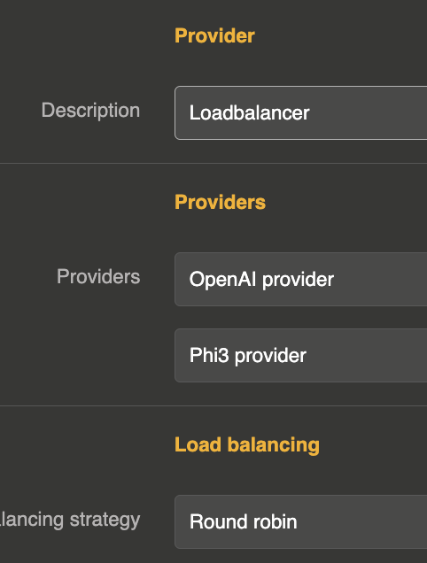

import Terminal from '@site/src/components/Terminal';

# Load Balancing

Load balancing distributes LLM requests across multiple providers, optimizing performance, ensuring availability, and preventing any single provider from being overloaded.

## How it works

The load balancer is a **virtual provider** of type `loadbalancer`. Instead of connecting directly to an LLM API, it wraps multiple real providers and routes each request to one of them according to a configurable strategy.

It supports all LLM operations: chat completion (blocking and streaming) and text completion (blocking and streaming).



## Creating a load balancer provider

Create a new LLM Provider entity with `provider` set to `loadbalancer`. The `connection` object is not used. All configuration goes into the `options` object.

```js
{
  "id": "provider_lb_1",
  "name": "My Load Balancer",
  "provider": "loadbalancer",
  "connection": {},
  "options": {
    "refs": [
      "provider_openai_1",
      "provider_anthropic_1",
      "provider_mistral_1"
    ],
    "loadbalancing": "round_robin"
  }
}
```

## Configuration

| Parameter | Type | Default | Description |
|-----------|------|---------|-------------|
| `refs` | array | `[]` | List of provider references (see below) |
| `loadbalancing` | string | `round_robin` | Load balancing strategy: `round_robin`, `random`, or `best_response_time` |
| `selector_expr` | string | — | Expression to filter providers based on request content (see below) |

### Provider references

The `refs` array can contain either simple provider IDs (strings) or objects with weight and selector:

**Simple format** — each provider has equal weight:

```js
{
  "refs": [
    "provider_openai_1",
    "provider_anthropic_1"
  ]
}
```

**Weighted format** — control traffic distribution with weights:

```js
{
  "refs": [
    { "ref": "provider_openai_1", "weight": 3 },
    { "ref": "provider_anthropic_1", "weight": 1 }
  ]
}
```

In this example, OpenAI would receive approximately 75% of requests and Anthropic 25%.

**With selector** — filter providers based on request content:

```js
{
  "refs": [
    { "ref": "provider_openai_1", "weight": 1, "selector_expected": "openai" },
    { "ref": "provider_anthropic_1", "weight": 1, "selector_expected": "anthropic" }
  ],
  "selector_expr": "model"
}
```

## Load balancing strategies

### Round Robin

Distributes requests sequentially across all providers in order. Each provider gets an equal share of traffic (adjusted by weights).

```js
{
  "loadbalancing": "round_robin"
}
```

### Random

Selects a random provider for each request. Over time, traffic is evenly distributed (adjusted by weights).

```js
{
  "loadbalancing": "random"
}
```

### Best Response Time

Tracks the average response time of each provider and routes requests to the provider with the lowest average. New providers (with no history) are tried first.

```js
{
  "loadbalancing": "best_response_time"
}
```

## Request-based routing with `selector_expr`

The `selector_expr` option allows you to route requests to specific providers based on the content of the request body. This is useful when you want to direct requests to different providers based on the model requested or other parameters.

### Field name

Use a simple field name to match against the request body merged with the provider options:

```js
{
  "selector_expr": "model",
  "refs": [
    { "ref": "provider_openai_1", "weight": 1, "selector_expected": "gpt-4o" },
    { "ref": "provider_anthropic_1", "weight": 1, "selector_expected": "claude-sonnet-4-20250514" }
  ]
}
```

A request with `"model": "gpt-4o"` will be routed to the OpenAI provider, while `"model": "claude-sonnet-4-20250514"` will go to Anthropic.

### JsonPointer

Use `JsonPointer(...)` for nested fields:

```js
{
  "selector_expr": "JsonPointer(/metadata/provider)"
}
```

### JsonPath

Use `JsonPath(...)` for complex path expressions:

```js
{
  "selector_expr": "JsonPath($.metadata.provider)"
}
```

### Wildcard

Use `*` to disable filtering (select from all providers):

```js
{
  "selector_expr": "*"
}
```

## Full example

A load balancer with weighted providers and best response time strategy:

```js
{
  "id": "provider_lb_production",
  "name": "Production LB",
  "description": "Load balancer across OpenAI and Mistral with failover",
  "provider": "loadbalancer",
  "connection": {},
  "options": {
    "refs": [
      { "ref": "provider_openai_prod", "weight": 2 },
      { "ref": "provider_mistral_prod", "weight": 1 }
    ],
    "loadbalancing": "best_response_time"
  },
  "provider_fallback": "provider_anthropic_backup"
}
```

This configuration:
- Routes requests to OpenAI (2/3) and Mistral (1/3) based on best response time
- Falls back to Anthropic if the selected provider fails (see [Fallback](/docs/llm-gateway/fallback))
